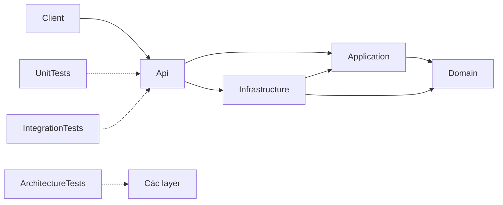

# Tổng quan kiến trúc LabX Backend

## 1. Trạng thái hiện tại

LabX Backend là base ASP.NET Core Web API chạy trên .NET 9, tổ chức theo Clean Architecture dạng gọn.
Repository hiện tập trung vào nền tảng kỹ thuật để bắt đầu phát triển; chưa có domain nghiệp vụ, database,
authentication/authorization hoặc test case cụ thể.

Trong bốn project source, `Api` là project duy nhất đã có hành vi chạy thực tế. `Application`, `Domain` và
`Infrastructure` mới có project cùng cấu trúc thư mục để bổ sung code khi có yêu cầu nghiệp vụ.

## 2. Chiều phụ thuộc



Quy tắc chính:

- `Domain` đứng độc lập, không tham chiếu project nào.
- `Application` chỉ phụ thuộc `Domain`.
- `Infrastructure` phụ thuộc `Application` và `Domain` để hiện thực các hợp đồng truy cập dữ liệu hoặc dịch vụ ngoài.
- `Api` phụ thuộc `Application` và `Infrastructure`, đồng thời là composition root lắp ráp toàn bộ ứng dụng.
- Không để `Domain` hoặc `Application` phụ thuộc ngược vào `Api` hay `Infrastructure`.

Dependency được khai báo trong các file `.csproj`. `ArchitectureTests` đã được tạo để bổ sung kiểm tra tự động
cho các quy tắc này khi cần.

## 3. Cấu trúc repository

```text
LabX/
├── .agents/                 Skills hướng dẫn Codex thực hiện từng loại công việc
├── .codex/agents/           Cấu hình các custom subagent
├── .github/                 GitHub Actions, Dependabot và mẫu pull request
├── docs/                    Kiến trúc, context, ADR, hướng dẫn và template
├── scripts/                 Script verify, smoke test và security scan
├── src/                     Source code ứng dụng
├── tests/                   Các project kiểm thử
├── AGENTS.md                Quy tắc chung khi agent làm việc trong repository
├── LabX_Be.sln              Solution .NET của backend
├── Directory.Build.props    Cấu hình build dùng chung
├── Directory.Packages.props Quản lý version package tập trung
├── global.json              Chọn SDK .NET 9
├── NuGet.Config             Cấu hình nguồn package
├── Dockerfile               Build Docker image của API
├── compose.yaml             Chạy API bằng Docker Compose
├── .editorconfig            Quy ước format và coding style
├── .gitignore               Loại file không đưa vào Git
├── .dockerignore            Loại file không gửi vào Docker build context
└── README.md                Điểm bắt đầu khi đọc và chạy dự án
```

Các folder `bin/`, `obj/`, `.vs/` và `artifacts/` là output do IDE, build hoặc test tạo ra. Chúng không thuộc
kiến trúc source và có thể được tạo lại.

## 4. Source code trong `src`

### 4.1. `src/Api`

`Api` là điểm vào của ứng dụng, tiếp nhận HTTP request, cấu hình dependency injection và chuyển kết quả use case
thành HTTP response.

```text
Api/
├── Controllers/             HTTP controllers của từng feature
├── Middleware/              Xử lý xuyên suốt HTTP pipeline
├── Filters/                 MVC/action/authorization filters khi cần
├── Extensions/              Extension đăng ký dịch vụ và cấu hình API
├── Properties/              Launch profile dùng khi chạy local
├── Program.cs               Composition root và HTTP pipeline
├── Api.csproj               Cấu hình project Web API
├── Api.csproj.user          Cấu hình debug cá nhân do Visual Studio tạo
├── appsettings.json         Cấu hình mặc định
├── appsettings.Development.json Cấu hình riêng cho Development
└── packages.lock.json       Phiên bản dependency đã resolve
```

#### Các folder

- `Controllers/`: chứa controller cho các endpoint nghiệp vụ. Controller nhận request, gọi Application và tạo
  HTTP response; không chứa business logic hoặc truy cập database trực tiếp. Folder hiện trống.
- `Middleware/`: chứa xử lý áp dụng cho nhiều request, hiện có logging và exception handling.
- `Filters/`: dành cho MVC filters khi có nhu cầu cụ thể. Folder hiện trống.
- `Extensions/`: gom các extension method đăng ký service để `Program.cs` ngắn và dễ đọc.
- `Properties/`: chứa cấu hình chạy local của Visual Studio và `dotnet run`.

#### Các file source đang hoạt động

- [`Program.cs`](../src/Api/Program.cs): tạo `WebApplication`, cấu hình JSON console logging, đăng ký service,
  lắp middleware và map controller, endpoint nền, health checks cùng OpenAPI. Khai báo `partial Program` để
  integration test sau này có thể dùng `WebApplicationFactory<Program>`.
- [`Extensions/ApiServiceExtensions.cs`](../src/Api/Extensions/ApiServiceExtensions.cs): đăng ký controllers,
  OpenAPI, health checks, exception handler, `ProblemDetails` có `traceId` và CORS lấy origin từ cấu hình.
- [`Middleware/GlobalExceptionHandler.cs`](../src/Api/Middleware/GlobalExceptionHandler.cs): ghi log exception
  chưa xử lý và trả lỗi 500 theo `ProblemDetails` mà không lộ chi tiết exception cho client.
- [`Middleware/RequestLoggingMiddleware.cs`](../src/Api/Middleware/RequestLoggingMiddleware.cs): đo thời gian,
  ghi method/path/status, tạo logging scope theo trace ID và trả header `X-Request-Id`.

#### HTTP pipeline

```text
HTTP Request
    ↓
RequestLoggingMiddleware
    ↓
Global Exception Handler
    ↓
Status Code Pages
    ↓
Routing
    ↓
CORS
    ↓
Controller / Endpoint
```

Các endpoint nền hiện có:

- `GET /`: trả tên ứng dụng và trạng thái đang chạy.
- `GET /health`: health check tổng hợp.
- `GET /health/live`: kiểm tra process đang sống.
- `GET /health/ready`: kiểm tra ứng dụng sẵn sàng; hiện chưa kiểm tra database hoặc dịch vụ ngoài.
- `GET /openapi/v1.json`: OpenAPI document, chỉ được map trong môi trường Development.

#### Các file cấu hình project

- [`Api.csproj`](../src/Api/Api.csproj): dùng Web SDK, tham chiếu `Application`, `Infrastructure` và package OpenAPI.
- [`appsettings.json`](../src/Api/appsettings.json): logging, allowed hosts và CORS mặc định đóng vì chưa có origin.
- [`appsettings.Development.json`](../src/Api/appsettings.Development.json): cho phép các frontend local đã cấu hình.
- [`Properties/launchSettings.json`](../src/Api/Properties/launchSettings.json): profile HTTP/HTTPS và environment local.
- `Api.csproj.user`: thiết lập debug riêng trên máy phát triển; không phải source kiến trúc và được Git bỏ qua.
- `packages.lock.json`: khóa dependency đã resolve để restore có tính lặp lại.

### 4.2. `src/Application`

`Application` chứa use case, DTO và các hợp đồng mà tầng ngoài phải hiện thực. Project này chỉ tham chiếu `Domain`.

```text
Application/
├── DTOs/
│   ├── Requests/            Dữ liệu đầu vào của use case
│   └── Responses/           Dữ liệu trả về từ use case
├── Interfaces/
│   ├── Services/            Hợp đồng application/external service
│   └── Repositories/        Hợp đồng truy cập dữ liệu
├── Services/                Điều phối các use case
├── Validators/              Validation cho DTO hoặc use case
├── Mappings/                Chuyển đổi DTO và domain model
├── Application.csproj       Cấu hình project và tham chiếu Domain
└── packages.lock.json       Dependency lock file
```

- `DTOs/Requests/`: model đầu vào; tách HTTP contract khỏi entity.
- `DTOs/Responses/`: model đầu ra; tránh trả trực tiếp cấu trúc domain hoặc database.
- `Interfaces/Repositories/`: khai báo abstraction truy cập dữ liệu; implementation đặt trong `Infrastructure`.
- `Interfaces/Services/`: khai báo hợp đồng application service hoặc dịch vụ ngoài mà use case cần.
- `Services/`: điều phối validation, domain rule, repository và kết quả use case.
- `Validators/`: chứa validation khi đã chọn cách triển khai phù hợp với feature.
- `Mappings/`: chuyển đổi giữa request, response và domain model.

Các folder trên hiện là scaffold trống; chưa có use case hoặc DTO nghiệp vụ.

### 4.3. `src/Domain`

`Domain` là lõi nghiệp vụ và không phụ thuộc framework web, database hay project khác.

```text
Domain/
├── Entities/                Đối tượng có định danh và vòng đời
├── Enums/                   Tập giá trị nghiệp vụ hữu hạn
├── ValueObjects/            Đối tượng bất biến được xác định bằng giá trị
├── Events/                  Domain events khi nghiệp vụ cần
├── Exceptions/              Exception cho luật nghiệp vụ
├── Common/                  Thành phần dùng chung bên trong Domain
├── Domain.csproj            Project lõi không có project reference
└── packages.lock.json       Dependency lock file
```

Tất cả folder nghiệp vụ hiện trống. Base không tự tạo `BaseEntity`, audit fields, domain event dispatcher hoặc
mô hình LabX khi chưa có yêu cầu chính thức.

### 4.4. `src/Infrastructure`

`Infrastructure` chứa implementation liên quan database và các hệ thống bên ngoài. Project này tham chiếu
`Application` và `Domain`.

```text
Infrastructure/
├── Data/
│   ├── Configurations/      Mapping entity với database
│   ├── Migrations/          Lịch sử thay đổi schema
│   └── Seed/                Khởi tạo dữ liệu theo môi trường
├── Repositories/            Implementation của repository interfaces
├── Services/                Adapter cho dịch vụ bên ngoài
├── DependencyInjection/     Đăng ký implementation vào DI container
├── Infrastructure.csproj    Cấu hình project và project references
└── packages.lock.json       Dependency lock file
```

- `Data/`: nơi đặt `DbContext` và thành phần persistence sau khi chọn database/ORM.
- `Data/Configurations/`: cấu hình table, column, index, relation và constraint.
- `Data/Migrations/`: migration đã được review; hiện chưa có migration.
- `Data/Seed/`: dữ liệu khởi tạo phù hợp từng môi trường, không chứa dữ liệu production thật.
- `Repositories/`: hiện thực interface từ `Application/Interfaces/Repositories/`.
- `Services/`: hiện thực email, storage, external API hoặc adapter khác khi có nhu cầu.
- `DependencyInjection/`: đăng ký repository, database và external services vào DI container.

Infrastructure hiện là scaffold trống. Dự án chưa chọn database provider, ORM hoặc external service.

## 5. Kiểm thử trong `tests`

```text
tests/
├── UnitTests/
│   ├── UnitTests.csproj
│   └── packages.lock.json
├── IntegrationTests/
│   ├── IntegrationTests.csproj
│   └── packages.lock.json
├── ArchitectureTests/
│   ├── ArchitectureTests.csproj
│   └── packages.lock.json
├── Directory.Build.props
└── AGENTS.md
```

- `UnitTests/`: kiểm thử class hoặc method riêng biệt như domain rule, application service, validator và mapping;
  không khởi động HTTP host hoặc kết nối database thật.
- `IntegrationTests/`: kiểm thử HTTP pipeline, serialization, dependency injection và persistence integration.
  Project đã có `Microsoft.AspNetCore.Mvc.Testing` để dùng `WebApplicationFactory<Program>`.
- `ArchitectureTests/`: kiểm tra dependency giữa các layer và phát hiện code đặt sai tầng.
- [`Directory.Build.props`](../tests/Directory.Build.props): cấu hình chung cho test projects, gồm xUnit,
  .NET Test SDK, runner và Coverlet collector.
- [`AGENTS.md`](../tests/AGENTS.md): quy tắc dành riêng cho công việc kiểm thử.
- Các `*.csproj`: mô tả project reference và package của từng loại test.
- Các `packages.lock.json`: khóa dependency của từng project test.

Hiện repository có ba test project nhưng có đúng 0 test case, theo trạng thái base đã yêu cầu.

## 6. Agent và skill dành cho Codex

Các file này hỗ trợ quy trình phát triển; chúng không được compile vào API và không chạy cùng ứng dụng.

### `.codex/agents`

- `backend_development.toml`: agent chuyên phát triển, debug và review backend.
- `software_design_specification.toml`: agent chuyên viết SDS, class diagram và sequence diagram.
- `testing.toml`: agent chuyên unit, integration và system testing.

Agent định nghĩa vai trò và cách chọn skill. Đây là custom subagent configuration của Codex.

### `.agents/skills`

Mỗi folder chứa một `SKILL.md` mô tả workflow chi tiết:

- `backend-development`: triển khai feature qua Domain, Application, Infrastructure và Api.
- `api-development`: endpoint, DTO, validation, HTTP contract và access control.
- `database-development`: persistence, query, transaction và migration sau khi đã chọn provider.
- `backend-debugging`: tái hiện, chẩn đoán và sửa lỗi backend.
- `code-review`: tìm lỗi cụ thể, regression, sai access control hoặc dependency.
- `software-design-specification`: tạo SDS và PlantUML; folder `references/` chứa quy ước vẽ diagram.
- `unit-testing`: viết test C# xUnit cô lập.
- `integration-testing`: kiểm thử HTTP host, middleware, DI hoặc persistence integration.
- `system-testing`: xây dựng và thực thi test cho luồng hoàn chỉnh.

Nội dung skill có thể tinh chỉnh độc lập về sau mà không thay đổi kiến trúc runtime của backend.

## 7. Tài liệu trong `docs`

- [`project-context.md`](project-context.md): mục tiêu hiện tại, quyết định đã chốt và các câu hỏi còn mở.
- [`architecture.md`](architecture.md): tài liệu tổng quan kiến trúc và trách nhiệm file/folder hiện tại.
- [`api/foundation.md`](api/foundation.md): contract của các endpoint nền đang hoạt động.
- [`testing/strategy.md`](testing/strategy.md): phạm vi unit, integration và system test.
- [`adr/0001-backend-foundation.md`](adr/0001-backend-foundation.md): Architecture Decision Record giải thích lựa chọn base.
- [`guides/agent-workflow.md`](guides/agent-workflow.md): cách chọn agent và skill theo loại công việc.
- [`guides/configuration.md`](guides/configuration.md): appsettings, environment variables, secrets và CORS.
- [`guides/verification.md`](guides/verification.md): cách chạy verify, smoke test, Docker và security scan.
- [`AGENTS.md`](AGENTS.md): quy tắc scoped khi agent sửa tài liệu.

`docs/templates/` chứa mẫu tái sử dụng, không phải file được chương trình thực thi:

- `adr.md`: ghi quyết định kiến trúc.
- `api-contract.md`: mô tả HTTP contract.
- `feature-spec.md`: đặc tả yêu cầu và acceptance criteria.
- `handoff.md`: bàn giao kết quả giữa các giai đoạn hoặc agent.
- `review.md`: báo cáo code review.
- `software-design.md`: Software Design Specification.
- `test-plan.md`: kế hoạch test chưa thực thi.
- `test-report.md`: kết quả test có bằng chứng thực thi.

## 8. Scripts

- [`scripts/verify.ps1`](../scripts/verify.ps1): restore ở locked mode, kiểm tra format, build Release, chạy test
  và xuất TRX/coverage vào `artifacts/`.
- [`scripts/smoke-test.ps1`](../scripts/smoke-test.ps1): khởi động Release API hoặc Docker image, gọi các endpoint
  nền và kiểm tra status/header; chỉ dừng process hoặc container do chính script tạo.
- [`scripts/security-check.ps1`](../scripts/security-check.ps1): dùng Trivy từ `PATH` để quét dependency, secret
  và Docker image tùy chọn; kết quả được ghi vào `artifacts/security/`.

Các script chỉ chạy khi được gọi thủ công hoặc từ CI; chúng không tự chạy khi mở solution hay chạy API.

## 9. Cấu hình tại root

- [`LabX_Be.sln`](../LabX_Be.sln): tập hợp bốn source projects và ba test projects trong một solution.
- [`global.json`](../global.json): chọn SDK 9.0.300 và cho phép dùng bản vá mới hơn trong cùng feature band.
- [`Directory.Build.props`](../Directory.Build.props): áp dụng `net9.0`, nullable, implicit usings, warnings as errors,
  static analysis, deterministic build, NuGet audit và lockfile cho các project.
- [`Directory.Packages.props`](../Directory.Packages.props): quản lý version NuGet package tại một nơi.
- [`NuGet.Config`](../NuGet.Config): xóa các nguồn kế thừa và chỉ sử dụng `nuget.org`.
- [`Dockerfile`](../Dockerfile): multi-stage build bằng .NET 9 SDK, publish API và chạy runtime bằng non-root user.
- [`compose.yaml`](../compose.yaml): build API image, chạy môi trường Production tại port 8080; chưa có database service.
- [`README.md`](../README.md): hướng dẫn chạy nhanh, cấu trúc và trạng thái base.
- [`AGENTS.md`](../AGENTS.md): quy tắc Codex tự đọc khi làm việc trong repository.
- [`.editorconfig`](../.editorconfig): format, indentation và coding style.
- [`.gitignore`](../.gitignore): bỏ qua IDE state, build output, artifacts và dữ liệu nhạy cảm.
- [`.dockerignore`](../.dockerignore): giảm Docker build context và tránh copy file không cần thiết.

## 10. Cấu hình GitHub

- [`.github/workflows/build-test.yml`](../.github/workflows/build-test.yml): workflow chuẩn bị sẵn để verify,
  smoke test, build Docker image, smoke test image, quét Trivy và upload artifacts.
- [`.github/dependabot.yml`](../.github/dependabot.yml): lịch kiểm tra cập nhật NuGet, GitHub Actions và Docker.
- [`.github/pull_request_template.md`](../.github/pull_request_template.md): mẫu ghi vấn đề, thay đổi, kiểm thử và
  ảnh hưởng cấu hình/tài liệu trong pull request.

Repository chưa khởi tạo Git hoặc kết nối source hosting. Vì vậy `.github/` là cấu hình chuẩn bị sẵn, chưa phải
bằng chứng workflow hoặc Dependabot đã chạy trên GitHub.

## 11. Cách thêm một feature

1. Ghi yêu cầu và acceptance criteria trong `docs/requirements/{feature}.md` khi feature đủ lớn.
2. Thêm entity, value object và business rule cần thiết vào `Domain`.
3. Thêm request/response DTO, interfaces, service, validator và mapping vào `Application`.
4. Nếu cần persistence hoặc dịch vụ ngoài, hiện thực chúng trong `Infrastructure` và đăng ký qua DI.
5. Thêm controller trong `Api/Controllers/` và chỉ xử lý trách nhiệm HTTP tại đây.
6. Bổ sung unit, integration hoặc architecture test phù hợp với rủi ro của thay đổi.
7. Cập nhật API contract, SDS hoặc ADR nếu hành vi và quyết định kiến trúc thay đổi.
8. Chạy `scripts/verify.ps1`; chạy smoke/security check khi phạm vi thay đổi yêu cầu.

Nếu chọn EF Core, đặt `DbContext` trong `Infrastructure/Data/`, entity mapping trong
`Data/Configurations/`, migration trong `Data/Migrations/` và seed trong `Data/Seed/`. Không thêm provider,
schema hoặc repository chung trước khi có yêu cầu nghiệp vụ và quyết định database.

## 12. Phạm vi đã có và chưa có

Base hiện đã có:

- Clean Architecture và dependency đúng chiều.
- ASP.NET Core .NET 9 chạy được.
- JSON console logging, request ID và đo thời gian request.
- Global exception handling và `ProblemDetails`.
- CORS theo environment, health checks và OpenAPI trong Development.
- Ba test projects, scripts verify/smoke/security, Docker và CI configuration.
- Bộ tài liệu, agent và skill phục vụ các giai đoạn phát triển.

Base hiện chưa có:

- Domain entity hoặc business rule.
- Use case, application service hoặc controller nghiệp vụ.
- Database, ORM, repository implementation, migration hoặc seed.
- Authentication, authorization, cache, background job hoặc external integration.
- Unit, integration, architecture hoặc system test case cụ thể.
- Business-specific API contract.

Cấu trúc hiện tại là nền để phát triển từng module theo chuỗi: yêu cầu và thiết kế → Domain/Application →
Infrastructure khi cần → Api → test → cập nhật tài liệu.
